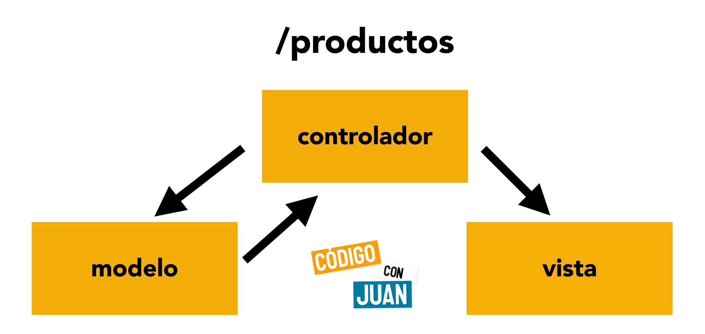
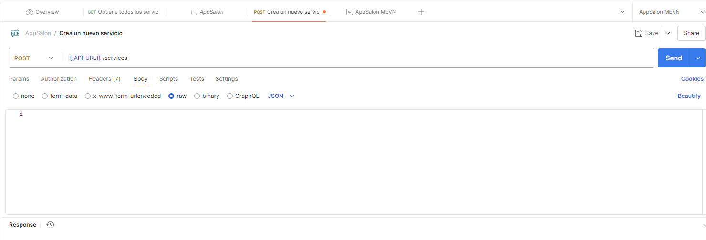
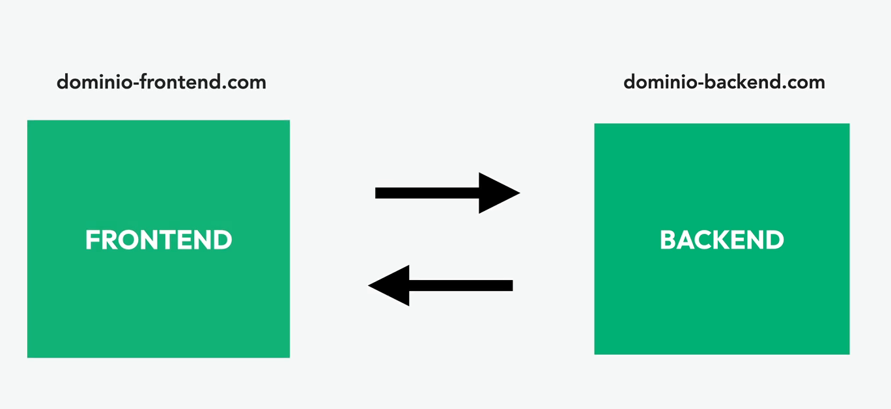

### MENV STACK

Un Stack es una serie de herramientas que utilizas para realizar un proyecto, debido a que estas herramientas usalmente se complementan es que nacieron los Stacks.

MEVN Stack son las iniciales de MongoDB Express.js Node.js y Vue.js

### Partes del MEVN Stack

#### MongoDB
MongoDB es un motor de base de datos NoSQL; eso quiere decir que no es una base de datos relacional pero puede almacenar grandes cantidades de datos

#### Express.js
Es un framework de Node.js a diferencia de otros frameworks casi no incluye nada; dándote la libertad de que herramientas utilizar. Su ventaja principal es que se puede utilizado como API o forma monolítica.

#### Vue.js
Es un framework de JavaScript para construir interfaces de usuario. Su ventaja principal es que es un framework de cliente, lo que significa que se encarga de la parte del usuario y no del servidor.Sin embargo Vue.js con Vite no puede sonsultar una base de datos; porlo que estaremos realizando una REST API.

#### Node.js
Es un entorno de ejecución de JavaScript que permite ejecutar código JavaScript fuera del navegador. Su ventaja principal es que es un entorno de ejecución de JavaScript que permite ejecutar código JavaScript fuera del navegador. 

La principal ventaja del MEVN  es que es un entorno de ejecución de JavaScript que permite ejecutar código JavaScript fuera del navegador. 

La segunda ventaja del MEVN Stack es que puedes utilizar la misma API para crea una aplicación móvil ya sea nativa o híbrida.


### Ejecución en local

Para poder ejecutar el proyecto en local, debes ejecutar el siguiente comando, el script dev:
```
npm run dev
```

Dentro del package json 
```
{
  "name": "appsalon_menv_backend",
  "version": "1.0.0",
  "description": "Backend para AppSalon en MENV",
  "main": "index.js",
  "scripts": {
    "start": "node index.js",
    "dev": "node --watch index.js"
  },
  "author": "Jose Balbuena Palma",
  "license": "ISC"
}

```

Donde el scrip de dev se le agrega un whatch para recargar automaticamate los cambios ehos en el proyecto

Instalar una dependecia en desarollo:

Instala la dependencia en desarollo solamente, nose recomiendsa en producción
```
npm i -D nodemon
```
Haciendo sude de dev nodemon seria asi el package.json:
```
{
  "name": "appsalon_menv_backend",
  "version": "1.0.0",
  "description": "Backend para AppSalon en MENV",
  "main": "index.js",
  "scripts": {
    "start": "node index.js",
    "dev": "nodemon index.js"
  },
  "author": "Jose Balbuena Palma",
  "license": "ISC",
  "devDependencies": {
    "nodemon": "^3.1.9"
  }
}

```

### Instalar dependencias
Instalando express:

```
npm i express
```

Lo minimo requerido para crear una aplicación en express:
```
const express = require('express');

// Configurar la app
const app = express();

// Definir una ruta
app.get('/', (req, res)=>{
    res.send('Hello World!');
});

// Definir puerto
// process.env.PORT es el puerto que se define en el archivo .env
const PORT = process.env.PORT || 4000;

// arrancar la app  
app.listen(PORT, () => {
    console.log(`Server is running on port ${PORT}`);
});    
```

### Uso de la sintaxis de ES6 (EMS vs commonjs)

Cambiar la extencion del archivo de .js a .mjs
En todas sus importaciones y exportaciones

La otra forma es en package.json cambiar a "type": "module"
```
{
  "name": "appsalon_menv_backend",
  "version": "1.0.0",
  "type": "module",
  "description": "Backend para AppSalon en MENV",
  "main": "index.js",
  "scripts": {
    "start": "node index.js",
    "dev": "nodemon index.js"
  },
  "author": "Jose Balbuena Palma",
  "license": "ISC",
  "devDependencies": {
    "nodemon": "^3.1.9"
  },
  "dependencies": {
    "express": "^5.1.0"
  }
}

```
### Arquitectura MVC(Model View Controller)

Es un patrón de diseño que permite separar la lógica de negocio de la presentación, en tres capas:

- Modelo: Es el esquema de la base de datos
- Vista: Es la forma en que se muestra la información al usuario
- Controlador: Es el encargado de manejar las peticiones del usuario

**Modelo**: Son los datos y logica del negocio de la aplicación; son los datos almacenados en la base de datos y la estructura de datos en memoria. El Modelo se encarga de interactuar con la base de datos. Y usualmente lo hace por medio de un ORM; en Node.js los más comunes son Sequelize y Mongoose y prisma.

**Vista**: Es la interfaz de nuestra aplicación; aqui mostramos las consultas a la base de datos, formularios de entrada de datos, botones, enlaces, etc.
En nuestro proyecto la vista estará realizada con Vue.js; puedes incluir un framework como Bootstrap o TailwindCSS, Vue Tailwind, etc.

**Controlador**: Es el intermediario ente el modelo y la vista; procesa las entradas de un formulario de la vista o pasa los adtos obtenidos en el modelo hacoa la vista, encaso de nuevos refistros, el controlador deberá obtenerlos den el modelo y compartirlos a la vista.



Ventajas de MVC:

La separación de responsabilidades entre el modelo, la vista y el controlador hace que el código sea más fácil de mantener y depurar, debido a que es un desarrollo modular. Tambien mejora la reutilización del código, ya que puedes reutilizar el controlador en diferentes vistas, sin afectar la lógica del negocio.

### Instalar Mongoose

Mongoose es un ORM para Node.js; es un framework que permite interactuar con MongoDB.
```
npm i mongoose
```

### Instalar DovEnv

DovEnv es un paquete que permite cargar variables de entorno desde un archivo .env.

```
npm i dotenv
```

### Instalar Colors

Colors es un paquete que permite agregar colores a la consola.

```
npm i colors
```
### Un schema de mongoose
En Mongoose, un Schema es una estructura que define la forma y las reglas de los documentos que se almacenarán en una colección de MongoDB. Es como un plano o plantilla que define:

Los campos que tendrá el documento
El tipo de datos de cada campo (String, Number, Date, etc.)
Si los campos son requeridos o no
Valores por defecto
Validaciones personalizadas
Índices
Por ejemplo, un schema básico en Mongoose podría verse así:

```js
const userSchema = new Schema({
  name: { 
    type: String, 
    required: true 
  },
  email: { 
    type: String, 
    required: true, 
    unique: true 
  },
  age: Number,
  createdAt: { 
    type: Date, 
    default: Date.now 
  }
});
```

Las peticiones HTTP son las peticiones que se hacen al servidor; estas peticiones son: GET, POST, PUT, DELETE.

GET: Obtiene datos
POST: Crea datos
PUT: Actualiza datos
DELETE: Elimina datos
PATCH: Actualiza datos parcialmente

### Status codes
200: OK
201: Created
204: No Content
400: Bad Request
401: Unauthorized
403: Forbidden
404: Not Found
500: Internal Server Error

Para enviar peticiones de tipo POST:




### Seeder

Un seeder es un script que permite cargar datos de prueba en la base de datos.

Ejecutar el seeder par importar datos:

```
npm run seed:import
```

Ejecutar el seeder par eliminar datos:

```
npm run seed:destroy
```

Ejecutar el seeder par eliminar datos:

```
npm run seed:destroy
```

Configuracion del seeder:

```js
{
  "name": "appsalon_menv_backend",
  "version": "1.0.0",
  "type": "module",
  "description": "Backend para AppSalon en MENV",
  "main": "index.js",
  "scripts": {
    "start": "node index.js",
    "dev": "nodemon index.js",
    "seed": "node data/seed.js",
    "seed:import": "node data/seed.js --import",
    "seed:destroy": "node data/seed.js --destroy"
  },
  "author": "Jose Balbuena Palma",
  "license": "ISC",
  "devDependencies": {
    "nodemon": "^3.1.9"
  },
  "dependencies": {
    "colors": "^1.4.0",
    "dotenv": "^16.5.0",
    "express": "^5.1.0",
    "mongoose": "^8.13.2"
  }
}
```

### ¿Que son los CORS?

CORS, por sus sigles en ingle´s   Cross-Origin Resource Sharing(Compartir recursos entre diferentes origenes), es un mecanismo de seguridad utilizada en los navegadores web para controlar la solicitud de recursos entre diferentes dominios. En escencia , CORS es una politica de seguridad implementada en el lado del servidor que permite o deniega las solicitudes de recursos web de un origen cruzado.

### Origen Cruzado o Cross-Origin
Cuando un recurso(como una fuente, una imagen o una hoja de estilo) se solicita desde un dominio o puerto diferente al del origen del recurso actual, se considera una solicitud de origen cruzado. Antes de que se implementaran CORS, los navegadores web modernos restringian automaticamente las peticiones de origen cruzado, para prevenir ataques de seguridad, como el secuestro de sesiones y la inyeccion de scripts maliciosos.



### Ventajas de CORS.
Seguridad: CORS permite a los servidores tener un control más granular sobre qué dominios pueden acceser a los recursos.
Esto reduce la posibilidad de ataques malisiosos de origen cruzado.

Acceso controlado a recursos: CORS permite a laos sitios web controlar que recursos estan disponibles para ser solicitados por dominios externos y que recursos estan disponibles para ser solicitados por dominios externos y que recursos están restringidos. Esto brinda mayor control sobre los datos y recursos del sitio web.

Interoperabilidad: CORS facilita el intercambio de datos y recursos entre diferentes dominios. Esto es particularmente útil en situaciones en las que una página web necesita cargar recursos de múltiples dominios para funcionar correctamente, como los casos de uso de una API o la carga de fuentes externas.

Instalacion de CORS:
```
npm i cors
```

Configuracion de CORS:
```
const cors = require('cors');

app.use(cors());
```

Para agregar cors para postman:

Agregamos en el index.js
```js
const whitelist = [process.env.FRONTEND_URL];

if(process.argv[2] === '--postman') {
    whitelist.push(undefined);
}

const corsOptions = {
    origin: function (origin, callback) {
        if (whitelist.includes(origin)) {
            // Permitir la conexion
            callback(null, true);
        } else {
            callback(new Error('Not allowed by CORS'));
        }
    }
};

app.use(cors(corsOptions));
```

y en el package.json

```json
{
  "name": "appsalon_menv_backend",
  "version": "1.0.0",
  "type": "module",
  "description": "Backend para AppSalon en MENV",
  "main": "index.js",
  "scripts": {
    "start": "node index.js",
    "dev": "nodemon index.js",
    "dev:postman": "nodemon index.js --postman",
    "seed": "node data/seed.js",
    "seed:import": "node data/seed.js --import",
    "seed:destroy": "node data/seed.js --destroy"
  },
  "author": "Jose Balbuena Palma",
  "license": "ISC",
  "devDependencies": {
    "nodemon": "^3.1.9"
  },
  "dependencies": {
    "colors": "^1.4.0",
    "cors": "^2.8.5",
    "dotenv": "^16.5.0",
    "express": "^5.1.0",
    "mongoose": "^8.13.2"
  }
}

```

### Autenticación y Registro de Usuarios

#### Registro de Usuarios
Para registar a los usuarios es importante hacerlo con algo que sea único: 
Targeta de crédito, número de celular o email.

Las cuentas siempre deben de confirmarse antes de darle acceso al usuario.

#### Principios de autenticación 
Existen diferentes formas de autenticar usuarios:

-    Con algo que el usaurio recuarda(email, password)
-    Con un dispositivo(Token, Celular, Mensaje)
-    Enlace mágico a algo que solo el usuario debe tener acceso.
-    Con algo físico(Huella, cara)

#### Algoritmos de autenticación
Email y password deben de coincidir.

Otras validaciones incluyen: Verificar si el usuario existe, si el usuario  existe pero el password es incorrecto, si ambos son correctos autenticar al usuario.

#### Autenticación y Segiridad

Los passwords siempre deben estar hasheados; esto evitará que un log en el servidor o un acceso no deseado a la base de datos comprometa las cuentas de nuestros usuarios.

Los passwords hasheados no se pueden revertir, entonces debemos encontrar una forma de darle al usario instrucciones para recuperar su acceso.

### BCRYPT

BCRYPT es un algoritmo de hasheo que permite hashear passwords.

```
npm i bcrypt
```

### Nodemailer

Nodemailer es un paquete que permite enviar correos electrónicos.

```
npm i nodemailer
```

### Instalar formkit

Formkit es un paquete que permite crear formularios.

```
npm i @formkit/vue @formkit/themes
```

